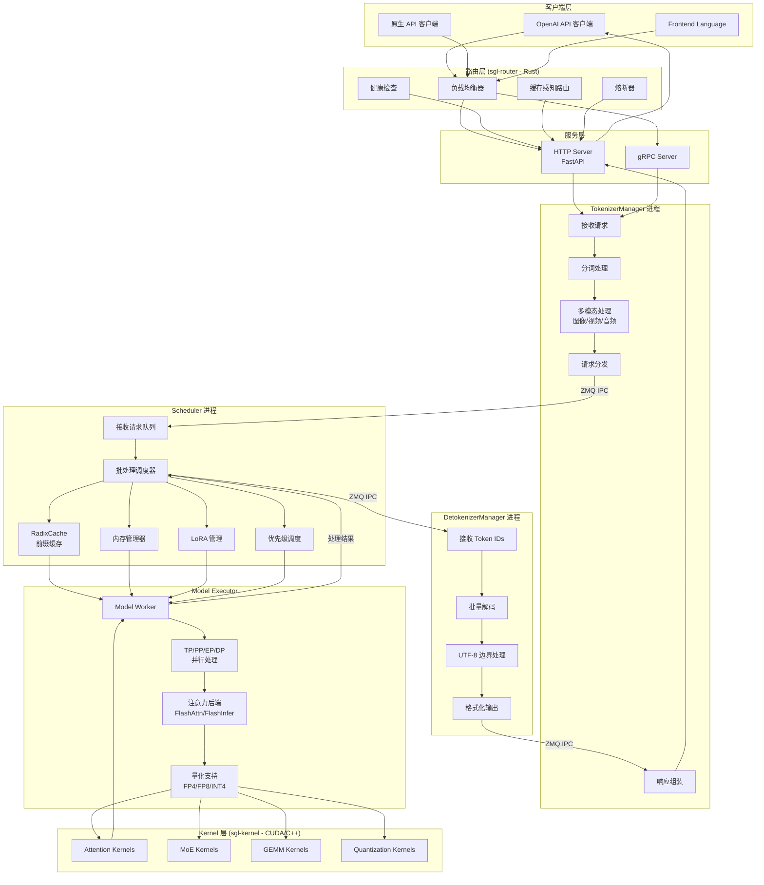
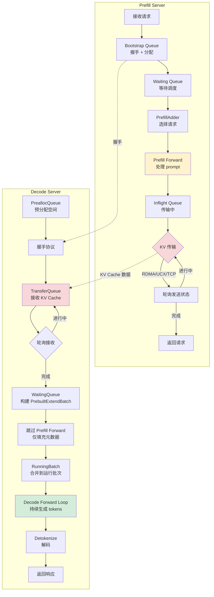

# SGLang 项目架构和流程图

## 项目概述

SGLang 是一个高性能的大语言模型（LLM）和视觉语言模型（VLM）推理服务框架，专为低延迟、高吞吐量设计，支持从单GPU到大规模分布式集群的各种部署场景。

**核心数据**：
- 全球超过 300,000 个 GPU 在使用
- 每日生成数万亿个 token
- 版本：0.5.4.post3
- 开源协议：Apache 2.0

---

## 1. 整体系统架构图



---

## 2. 详细请求处理流程图

```mermaid
flowchart TD
    Start([HTTP/gRPC 请求]) --> Receive[TokenizerManager<br/>接收请求]

    Receive --> Tokenize{是否需要分词?}
    Tokenize -->|文本请求| TokenProcess[执行分词<br/>text → token IDs]
    Tokenize -->|Embedding| EmbedProcess[Embedding 处理]
    TokenProcess --> MultiModal{是否多模态?}
    MultiModal -->|是| MMProcess[图像/视频处理<br/>mm_processor]
    MultiModal -->|否| SendScheduler
    MMProcess --> SendScheduler
    EmbedProcess --> SendScheduler

    SendScheduler[发送到 Scheduler<br/>ZMQ IPC] --> SchedReceive[Scheduler 接收]

    SchedReceive --> WaitingQueue[加入等待队列]
    WaitingQueue --> SchedulerLoop{调度循环}

    SchedulerLoop --> CheckMemory{检查内存}
    CheckMemory -->|不足| Eviction[RadixCache 驱逐]
    Eviction --> CheckMemory
    CheckMemory -->|充足| PrefixMatch[RadixCache<br/>前缀匹配]

    PrefixMatch --> CacheHit{缓存命中?}
    CacheHit -->|部分命中| ReuseCached[复用缓存的 KV]
    CacheHit -->|未命中| AllocNew[分配新的 KV 空间]
    ReuseCached --> BatchDecision
    AllocNew --> BatchDecision

    BatchDecision{批处理决策}
    BatchDecision -->|创建 Prefill Batch| PrefillBatch[Prefill Batch<br/>新请求处理]
    BatchDecision -->|运行 Decode Batch| DecodeBatch[Decode Batch<br/>继续生成]

    PrefillBatch --> PrefillForward[Model Forward<br/>Prefill 模式]
    DecodeBatch --> DecodeForward[Model Forward<br/>Decode 模式]

    subgraph "Model Execution"
        PrefillForward --> TPParallel[Tensor Parallel<br/>分布式计算]
        DecodeForward --> TPParallel
        TPParallel --> Attention[Attention 计算<br/>FlashAttn/FlashInfer]
        Attention --> Quantize{量化?}
        Quantize -->|是| QuantKernel[量化 Kernels<br/>FP4/FP8/INT4]
        Quantize -->|否| StandardKernel[标准 Kernels]
        QuantKernel --> MoECheck
        StandardKernel --> MoECheck
        MoECheck{MoE 模型?}
        MoECheck -->|是| MoEKernel[MoE Kernels<br/>Expert Parallel]
        MoECheck -->|否| GEMM[GEMM Kernels]
        MoEKernel --> Sample
        GEMM --> Sample
        Sample[Token Sampling<br/>生成下一个 token]
    end

    Sample --> ProcessResult[处理批次结果]

    ProcessResult --> UpdateCache[更新 RadixCache]
    UpdateCache --> CheckFinished{请求完成?}

    CheckFinished -->|是| CacheFinished[缓存完整请求<br/>到 RadixCache]
    CheckFinished -->|否| CachePartial[缓存部分请求]
    CheckFinished -->|继续生成| MergeBatch[合并到 Running Batch]

    CacheFinished --> SendDetoken
    CachePartial --> MergeBatch
    MergeBatch --> SchedulerLoop

    SendDetoken[发送到 Detokenizer<br/>ZMQ IPC] --> DetokReceive[DetokenizerManager<br/>接收 Token IDs]

    DetokReceive --> IncrementalDecode[增量解码<br/>batch_decode]
    IncrementalDecode --> UTF8Check{UTF-8 有效?}
    UTF8Check -->|是| BuildResponse[构建响应]
    UTF8Check -->|否| Wait[等待更多 tokens]
    Wait --> DetokReceive

    BuildResponse --> SendTokenizer[发送到 TokenizerManager<br/>ZMQ IPC]
    SendTokenizer --> AssembleResp[TokenizerManager<br/>组装响应]

    AssembleResp --> Streaming{流式响应?}
    Streaming -->|是| StreamChunk[发送 SSE chunk]
    Streaming -->|否| CompleteResp[完整响应]

    StreamChunk --> CheckDone{生成完成?}
    CheckDone -->|否| DetokReceive
    CheckDone -->|是| End
    CompleteResp --> End([返回给客户端])

    style Start fill:#e1f5ff
    style End fill:#e1f5ff
    style PrefillForward fill:#fff3cd
    style DecodeForward fill:#fff3cd
    style RadixCache fill:#d1ecf1
    style Sample fill:#f8d7da
```



---

## 3. Prefill-Decode 分拆模式（Disaggregation）



---

## 4. RadixCache 前缀缓存机制

```mermaid
graph TB
    subgraph "RadixCache 树结构"
        Root[Root Node] --> N1[Token: 101]
        Root --> N2[Token: 102]
        N1 --> N3[Token: 103]
        N1 --> N4[Token: 104]
        N3 --> N5[Token: 105<br/>KV Indices: 0-4]
        N4 --> N6[Token: 105<br/>KV Indices: 0-3, 6]
    end

    subgraph "请求处理"
        R1[新请求: [101,103,105]] --> Match[前缀匹配]
        Match --> Hit{匹配结果}
        Hit -->|完全匹配| Reuse[复用 KV: 0-4]
        Hit -->|部分匹配| Partial[复用 KV: 0-2<br/>计算新 token]
        Hit -->|无匹配| Compute[从头计算]

        Reuse --> Skip[跳过已缓存部分]
        Partial --> Append[追加新计算]
        Compute --> Insert[插入新节点]
    end

    subgraph "驱逐策略"
        E1[内存不足] --> E2[收集叶子节点]
        E2 --> E3{驱逐策略}
        E3 -->|LRU| E4[最久未使用]
        E3 -->|LFU| E5[最少使用]
        E3 -->|FIFO| E6[最先插入]
        E4 --> E7[释放 KV 空间]
        E5 --> E7
        E6 --> E7
        E7 --> E8{检查 lock_ref}
        E8 -->|> 0| Skip[跳过锁定节点]
        E8 -->|= 0| Free[释放节点]
    end

    Match -.-> Root

    style Root fill:#e1f5ff
    style N5 fill:#d4edda
    style N6 fill:#d4edda
    style Reuse fill:#d4edda
```

---

## 5. 核心创新特性

### 5.1 RadixAttention
- **自动前缀缓存**：使用 Radix 树自动共享常见前缀
- **KV Cache 复用**：多个请求共享相同的 prompt 前缀
- **内存效率**：大幅减少重复计算和内存占用

### 5.2 持续批处理（Continuous Batching）
- **动态批处理**：混合 Prefill 和 Decode 请求
- **即时调度**：新请求立即加入批次
- **吞吐量优化**：最大化 GPU 利用率

### 5.3 分块 Prefill（Chunked Prefill）
- **长上下文支持**：将长 prompt 分块处理
- **内存控制**：限制单次前向传播的 token 数量
- **延迟优化**：平衡 TTFT（首 token 时间）和吞吐量

### 5.4 Prefill-Decode 分拆
- **计算分离**：独立的 Prefill 和 Decode 服务器
- **资源优化**：
  - Prefill：计算密集，适合高性能 GPU
  - Decode：延迟敏感，适合低延迟 GPU
- **扩展性**：独立扩展 Prefill/Decode 容量

### 5.5 并行策略
- **Tensor Parallel (TP)**：模型参数跨 GPU 分片
- **Pipeline Parallel (PP)**：模型层跨 GPU 分片
- **Expert Parallel (EP)**：MoE 模型的专家并行
- **Data Parallel (DP)**：多副本处理不同请求

### 5.6 量化支持
- **FP8**：8 位浮点量化
- **FP4**：4 位浮点量化
- **INT4**：4 位整数量化
- **AWQ/GPTQ**：权重量化算法

---

## 6. 关键代码位置

| 组件 | 文件路径 | 行数参考 |
|------|---------|---------|
| HTTP 入口 | `/python/sglang/srt/entrypoints/http_server.py` | 531-566 |
| TokenizerManager | `/python/sglang/srt/managers/tokenizer_manager.py` | 398-439, 904-918 |
| Scheduler | `/python/sglang/srt/managers/scheduler.py` | 957-1002, 1629-1828 |
| RadixCache | `/python/sglang/srt/mem_cache/radix_cache.py` | 251-321, 323-396 |
| DetokenizerManager | `/python/sglang/srt/managers/detokenizer_manager.py` | 152-280 |
| Prefill 服务器 | `/python/sglang/srt/disaggregation/prefill.py` | 68-150 |
| Decode 服务器 | `/python/sglang/srt/disaggregation/decode.py` | 78-150 |
| Model Worker | `/python/sglang/srt/managers/scheduler.py` | 1943-2053 |

---

## 7. 性能优化技术

### 7.1 Zero-Overhead Scheduler
- CPU 调度器优化，最小化开销
- 重叠 CPU 处理和 GPU 计算
- 异步结果队列流水线

### 7.2 Kernel 优化
- **FlashAttention**：高效注意力计算
- **FlashInfer**：KV Cache 优化版本
- **Custom CUDA Kernels**：针对 SGLang 优化
- **CUDA Graph**：减少 kernel 启动开销

### 7.3 内存管理
- **Paged Attention**：分页 KV Cache 管理
- **Memory Pool**：预分配内存池
- **动态分配**：按需分配和释放
- **RadixCache 驱逐**：智能缓存淘汰（LRU/LFU）

### 7.4 通信优化
- **ZMQ IPC**：进程间高速通信
- **RDMA/UCX**：低延迟 KV Cache 传输
- **NCCL**：高效集体通信（All-Reduce）

---

## 8. 支持的模型家族

- **LLaMA 系列**：LLaMA, LLaMA-2, LLaMA-3, CodeLLaMA
- **Qwen 系列**：Qwen, Qwen2, Qwen2-VL, Qwen-MoE
- **DeepSeek 系列**：DeepSeek, DeepSeek-V2, DeepSeek-V3
- **Mistral 系列**：Mistral, Mixtral, Codestral
- **视觉模型**：LLaVA, MiniCPM-V, InternVL, Phi-3-Vision
- **其他**：Gemma, GLM4, ChatGLM, Phi, StableLM, Yi 等 120+ 模型

---

## 9. 生产部署特性

### 9.1 监控和可观测性
- **Prometheus Metrics**：性能指标暴露
- **OpenTelemetry Tracing**：分布式追踪
- **Health Checks**：健康检查端点
- **日志系统**：结构化日志记录

### 9.2 API 兼容性
- **OpenAI API**：完全兼容 OpenAI 格式
- **原生 API**：高性能原生接口
- **gRPC API**：低延迟 RPC 调用

### 9.3 高级功能
- **结构化输出**：JSON Schema、正则表达式、语法约束
- **Function Calling**：工具调用和函数执行
- **Multi-LoRA**：批量处理不同 LoRA 适配器
- **Speculative Decoding**：EAGLE、EAGLE-2 推测解码

### 9.4 部署选项
- **单机部署**：单 GPU 或多 GPU
- **分布式集群**：多节点 TP/PP/DP
- **Kubernetes**：容器化部署
- **Docker**：预构建镜像

---

## 10. 项目统计

- **代码库大小**：2.4MB+ 模型代码，117KB+ 调度代码
- **支持模型**：120+ 模型架构
- **测试覆盖**：170+ 测试模块
- **文档**：完整的入门、高级特性、平台支持文档
- **硬件支持**：NVIDIA、AMD、Intel、Google TPU、Huawei Ascend
- **社区**：LMSYS 非营利组织托管

---

## 总结

SGLang 是一个企业级的 LLM 推理框架，通过以下核心技术实现高性能：

1. **RadixAttention**：自动前缀缓存，大幅提升缓存命中率
2. **持续批处理**：动态混合 Prefill/Decode，最大化吞吐量
3. **Prefill-Decode 分拆**：独立扩展，优化资源利用
4. **定制 Kernels**：CUDA 级优化，极致性能
5. **多层并行**：TP/PP/EP/DP 组合，支持超大模型
6. **生产就绪**：完整的监控、追踪、健康检查、API 兼容

适用场景：
- 大规模生产环境（日均万亿 tokens）
- 低延迟要求（TTFT < 100ms）
- 高吞吐量需求（> 10K tokens/s）
- 多模态推理（文本 + 图像/视频）
- 复杂约束生成（JSON、工具调用）
